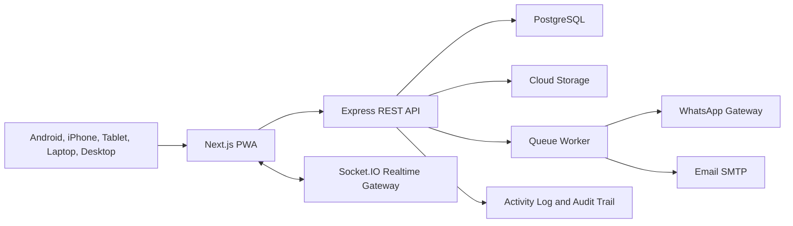

# Arsitektur Sistem

## Frontend

- Next.js App Router untuk PWA, SEO, dan routing berbasis role.
- React Query untuk caching dan invalidation data.
- Socket.IO client untuk event `attendance.updated`, `memorization.updated`, `payment.updated`, dan `announcement.published`.
- Tailwind CSS untuk design system ringan.
- ECharts untuk grafik interaktif BI.

## Backend

- Express REST API dengan versi `/api/v1`.
- JWT access token pendek dan refresh token httpOnly cookie.
- Role permission di middleware, lalu diperkuat dengan policy per endpoint.
- Socket.IO untuk broadcast realtime.
- Rate limiting, Helmet, CORS allowlist, payload size limit.

## Database

- PostgreSQL sebagai source of truth.
- Normalisasi data master dan transactional.
- Index khusus pada `student_id + created_at`, `campaign_id + paid_at`, dan status tagihan.
- Audit log append-only.

## Production Scale

- Load balancer di depan web dan API.
- API berjalan stateless dalam beberapa replica.
- Redis untuk session cache, queue, dan Socket.IO adapter.
- Object storage untuk foto, sertifikat, dokumen, dan video.
- Backup PostgreSQL harian, point-in-time recovery, monitoring metrics dan logs.
