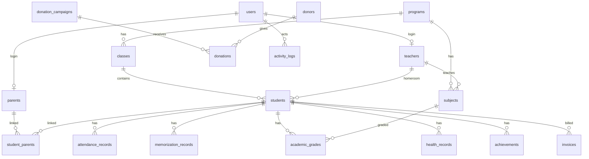

# ERD dan Relasi Database

## Catatan Desain

- `students` dipisah dari `parents` karena satu santri dapat memiliki lebih dari satu wali, dan satu orang tua dapat memiliki lebih dari satu anak.
- `memorization_records` memakai `type` agar Qur'an, hadits, dan kitab bisa memakai alur input yang sama namun tetap terfilter.
- `activity_logs` tidak boleh diubah setelah dibuat agar audit trail valid.
- Untuk pencarian global skala besar, tambahkan materialized search table atau OpenSearch setelah data tumbuh.
